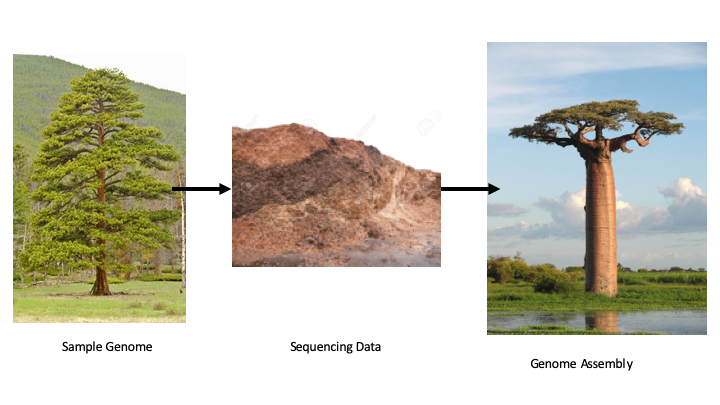

```{r setup, include=FALSE}
knitr::opts_chunk$set(echo = TRUE)
```
# Overview

Illumina sequencing-by-synthesis technology is the dominant form of DNA sequencing at present. If you continue in biological research it is likely you will encounter this kind of thing at some point. Illumina is also becoming more widespread in medical genomic sequencing (e.g., cancer tumors, microbiome/metagenomics, pathogen ID). Illumina produces 'short-read' sequence data that usually consists of millions of 50-200 bp sequences. These are often "paired" (i.e., read in both directions which may or may not overlap in the middle). 


# Genome Assembly

Challenge: Assemble a 1 billion piece puzzle where the pieces are all made of only 4 colors and repeated shapes.

```{r echo=FALSE, out.width='100%', fig.align='center'}

```

## Setup

```{bash, eval = FALSE}
fastq-dump -A "SRR7694205" --split-3
less SRR7694205_1.fastq

```

## fastqc

If you have not already please use conda to install fastqc.

```{bash, eval=FALSE}
conda install -c bioconda fastqc
```

The quality scores recorded in the fastq files here are known as phred scores. The letters are codes for relative probability of error that can be found in a table [here](https://www.drive5.com/usearch/manual/quality_score.html). Using that table and the 'head' or 'less' commands read a few quality score strings and try to 'feel out' what the relative error looks like. Are there any patterns? Are some reads 'better' than others?

There is a better way. We can use the program fastqc to visualize quality scoreso and more!

```{bash, eval=FALSE}
fastqc SRR7694205_* #This will run fastqc twice, once for each read file

```

Then look for the *.html files that were created and open for viewing.

## Abyss 

Conda install Abyss assembler and OpenMPI for parallelization. (NOTE: You must install openmpi first)

```{bash, eval=F}
conda install -c conda-forge openmpi
conda install -c bioconda Abyss
```

[Illumina technical note on short read de novo assembly](https://www.illumina.com/Documents/products/technotes/technote_denovo_assembly_ecoli.pdf)

Abyss is one option for *de novo* assembly with short (Illumina) data. For complex genomes Abyss can be a powerful assembler capable of resolving complex genomic structure. Like most de novo assemblers Abyss operates on graph theory wherein a network of read similarity is used to trace graphs (paths) connecting individual reads with potentially overlapping reads. All graph based assemblers first assemble the graph data structure and then process the graph for the longest *contigs*, or segments of sequence data that appear to be contiguous. 

We will try out Abyss for our Zika data. The assemblies will not be perfect, but we can get a feel for how these analyses work and the kinds of data that we get back.

```{bash, eval =F}
abyss-pe name=zika1 k=75 in='SRR7694205_1.fastq SRR7694205_2.fastq' np=8 # Run abyss with 8 parallel instances

cat zika1-contigs.fa
```

[What is N50](http://www.molecularecologist.com/2017/03/whats-n50/)

What is the longest *contig* that Abyss was able to assemble? How many contigs were there?

Check the longest contig against the NCBI databases using the [online blast portal](https://blast.ncbi.nlm.nih.gov/Blast.cgi?PROGRAM=blastn&PAGE_TYPE=BlastSearch&LINK_LOC=blasthome)

# Homework: 

[Read the Illumina technical note on genome assembly](https://www.illumina.com/Documents/products/technotes/technote_denovo_assembly_ecoli.pdf) and post an explanation of one figure or table to slack [#discussion](https://introbioinformatics.slack.com/messages/CN3DX55M3)