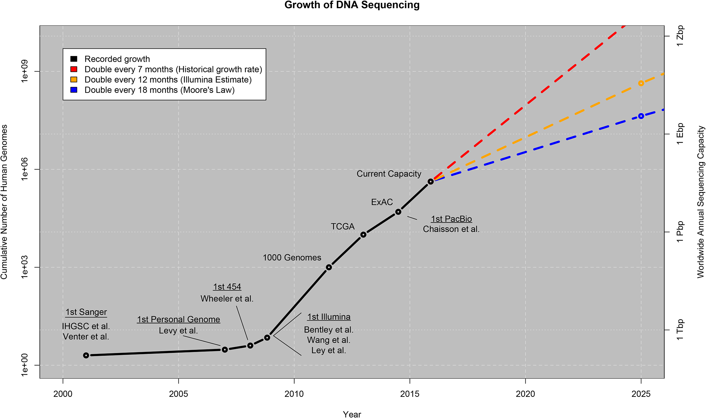
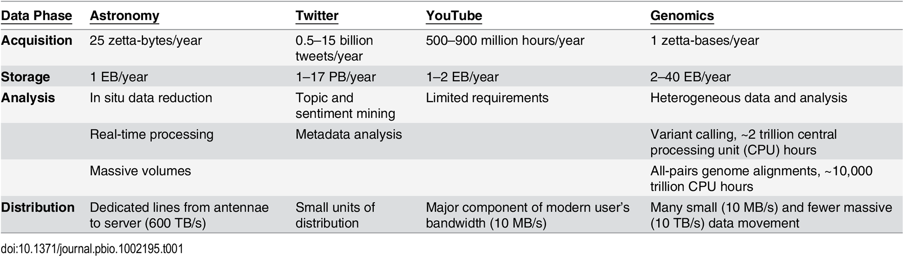
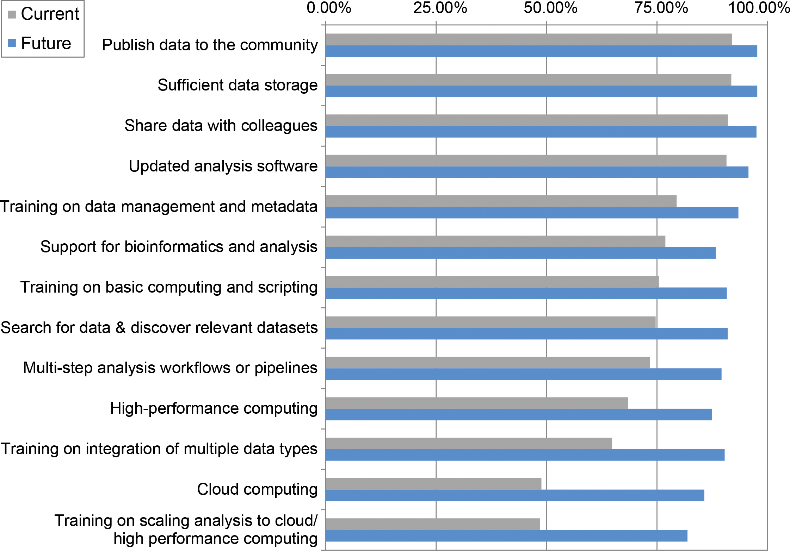

## Biology as a Data Science

The growth of data generation and collection is far outpacing the ability to process data in many fields. Today we will discuss what makes up "Data Science" and how biology and bioinformatics fits in the context of:

+ Definitions of "Data Science" and how it differs (or not) from statistics and computational sciences.
+ Types and volume of data in Biology
+ Speculating about the future of data driven biological inquiry.

--- 

## Defining Data Science

"Data science has been called "the sexiest job of the 21st century,"
presumably by someone who has never visited a fire station."
-- [From "Data Science From Scratch"](http://shop.oreilly.com/product/0636920033400.do)

```{r echo=FALSE, out.width='30%', fig.align='center'}
knitr::include_graphics('./images/Data_Science_VD.png')
```


  [Drew Conway](http://drewconway.com/zia/2013/3/26/the-data-science-venn-diagram)

---

## Defining Data Science

Data Scientist (n.): 

"Person who is better at statistics than any software engineer and better at software engineering than any statistician."  

-Josh Wills (Data Engineer)   

[Via Twitter](https://twitter.com/josh_wills/status/198093512149958656?lang=en)

---


## Bioinformatics


The "Data Science" of Biology


+ "Person who is better at biology than any programmer and better at programming than any biologist." 
+ An intersection of coding skill, math/stats functionality, and biological specialization.
+ [Current Example](https://careers.amnh.org/postings/2056)

<br><br>

In both Data Science and Bioinformatics the jobs of the future are going to require the basics of data oriented disciplines. 

+ Data processing skills are the "new normal" expected for professionals in all fields.

---


## Big Data in Biology | Is there a "big-data" problem or a "BIG" data problem?

+ What qualifies as "big-data"?
+ What is the biggest source of biological data?
+ Where are other sources of potentially big data in biology?

---


## Big Data: Volume, velocity, variety, and veracity

The 4 'V's of big data:

+ How much data is there now?
+ How quickly are we making/recording/streaming more?
+ How 'dirty' is it? 
+ Can we trust data as truth?

And [more](https://www.ibmbigdatahub.com/sites/default/files/infographic_file/4Vs_Infographic_final.pdf)

---


## How big is biological data?

The top data producer in biology is clearly DNA sequencing:

[Big Data: Astronomical or Genomical](https://journals.plos.org/plosbiology/article?id=10.1371/journal.pbio.1002195)


```{r echo=FALSE, out.width='70%', fig.align='center'}

```


---


## Genomics, Astronomy, Twitter, Youtube comparison:
```{r echo=FALSE, out.width='90%', fig.align='center'}

```


---


## Genomic data "Variety"

The alphabet of the genome has 4 letters (ACGT).


+ What is the probability of any given 12 letter word occurring more than once in the human genome? (Hint: you might need to look up how big the human genome is)

---

## Growing data and unmet needs:

"The current Illumina HiSeq X sequencing platform can generate 900 billion nucleotides of raw DNA sequence in under 3 days-4 times the number of annotated nucleotides currently stored in GenBank, the United States "reference library" of DNA sequences [1, 2]. In the last decade, a 50,000-fold reduction in the cost of DNA sequencing [3] has led to an accumulation of 9.3 quadrillion (million billion) nucleotides of raw sequence data in the National Center for Biotechnology Information (NCBI) Sequence Read Archive (SRA). The amount of sequence in the SRA doubled on average every 6-8 months from 2007-2016 [4, 5]."
[ref](https://journals.plos.org/ploscompbiol/article?id=10.1371/journal.pcbi.1005755)

---

## Labor needs

[90% of NSF grant funded labs say they will need help analyzing data they are generating now](https://journals.plos.org/ploscompbiol/article?id=10.1371/journal.pcbi.1005755)

"The problem is the growing gap between the accumulation of big data and researchers' knowledge about how to
use it effectively."

```{r echo=FALSE, out.width='40%', fig.align='center'}

```

---

## Other areas of Biological data growth

"Beyond genotypic data, big data are flooding biology from all quarters-phenotypic data from agricultural field trials, patient medical records, and clinical trials; image data from microscopy, medical scanning, and museum specimens; interaction data from biochemical, cellular, physiological, and ecological systems; as well as an influx of data from translational fields such as bioengineering, materials science, and biogeography"
[ref](https://journals.plos.org/ploscompbiol/article?id=10.1371/journal.pcbi.1005755)

---

## Other areas of Biological data growth

Phenotypic Data

+ High throughput imaging
+ 3D scanning and printing
+ Next-gen imaging (CT scanning, fluorescent microscopy)
+ e.g. [Plant Image Analysis](http://www.plant-image-analysis.org/) and [High-throughput plant phenotyping](https://pubag.nal.usda.gov/download/60481/PDF)

```{r echo=FALSE, out.width='50%', fig.align='center'}
knitr::include_graphics('./images/plantcv_001.jpg')
```


Ecological Data Aggregation

+ [GBIF](https://www.gbif.org)
+ [iDigBio](https://www.idigbio.org/)

---

## Citizen Science

A recent trend in data collection has been to offload the work of observation to non-professionals. Interested participants use a web interface (typically smartphone apps) to record observations of something scientists are interested in. 

+ People love birding: [eBird](https://www.ebird.org) has over 500 million citizen science observations. [ref](https://ebird.org/news/500-million-ebird-records) 
+ And a cool smartphone app [iNaturalist](https://www.inaturalist.com) with nifty image recognition [software](https://www.inaturalist.org/pages/computer_vision_demo)

---

## Satellite Remote Sensing

Earth observation satellites have a growing history of contributing to our ability to map and model ecosystems and global ecological change. The scale of earth observation image collection is on the order of 10s of terabytes of data per day!

+ [Landsat](https://landsat.usgs.gov/) is a NASA mission and is the longest running earth observation satellite mission with [>40 years of imagery](https://gisgeography.com/landsat-program-satellite-imagery-bands/), growing by ~1200 images (1TB) of free and open access data every DAY.
+ Researchers can capture things like [primary productivity](https://www.tandfonline.com/doi/pdf/10.1080/01431168608948944?needAccess=true), [phytoplankton communities](https://www.frontiersin.org/articles/10.3389/fmars.2017.00041/full), and [ecosystem type](https://besjournals.onlinelibrary.wiley.com/doi/epdf/10.1111/2041-210X.13018) with satellites through analysis of multispectral (beyond visible light) images.

---

## For next time:

Pick one of the "big-data" resources mentioned in the preceeding slides, research the 4V's relating to that project and prepare to speak for ~2 minutes on your findings on Monday to share your findings with the class. 

+ So that we don't have duplicates please sign up on the Slack [#topics channel](https://bio200-bioinformatics.slack.com/messages/CCMH74VNY)
+ If you find or no of a big-data project not mentioned here (and there are many!) feel free to research what you find interesting.


[end](https://rsh249.github.io/bioinformatics)

---
