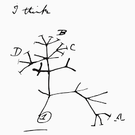

```{r setup, include=FALSE}
knitr::opts_chunk$set(echo = TRUE)
```

```{r echo=FALSE, out.width='30%', fig.align='center'}

```
*Wikimedia Commons Image*


# Algorithms for Sequence Alignment

### Complexity

*Discuss*: Which adds more complexity when comparing sequences or strings of text -- Adding length to the sequences or adding more sequences to the comparison?

How many possible pairwise comparisons can be made between two DNA sequence strings of length 10?

AAACGTTATC

CGAAACGTAA

comp = (n*l)^n
Where n is the number of sequences and l is the length.

What if we add another DNA sequence?

```{R}
n = 1:1000
l = 1:1000
#Pairwise comparisons
plot(l, (2*l)^2, type ='l', ylab='# comparisons', xlab='Sequence Number or Length')
#Multiple comparisons
points(n, ((n*10)^n), type = 'l', col='blue')

```

# Multiple Sequence Alignment

MSA refers to the task of performing *global* alignments of nucleotide or protein sequences to assess total similarity or *Homology*. This is a fundamental task in Bioinformatics but also one of the single most challenging things to do algorithmically. It is for this reason that you should always be skeptical of MSA and any program that claims to do it well. They all fail sometimes and detecting that can be very difficult particularly when datasets are very large.

In a very unscientific literature search protocol Google Scholar pulls up 1.5 million hits for the search "Multiple sequence alignment algorithm":
https://scholar.google.com/scholar?hl=en&as_sdt=0%2C22&q=multiple+sequence+alignment+algorithm&btnG=


Some literature comparing different programs for MSA:

https://journals.plos.org/plosone/article/file?id=10.1371/journal.pone.0018093&type=printable

https://www.ncbi.nlm.nih.gov/pmc/articles/PMC4015676/pdf/1748-7188-9-4.pdf


### Prerequisites for MSA

In order to perform an MSA properly you need:

+ Homologous sequences (from the same or related genes/sequence fragments)
+ Approximately the same starting length
+ Organized in one fasta formatted file.

We will work with a file of complete mitochondrial genome sequences. These sequences will be from animals so we expect that they are homologous (i.e., sharing a single ancestral mitochondrial genome sequence).


## Getting data

First, create a new working directory for today containing a directory named 'data':

```{bash, eval=TRUE, message=FALSE}
mkdir msa
cd msa
mkdir data
ls -l
```

Once in the new 'msa' directory download some CO1 (gene) sequences from the course repository:

```{bash, eval=TRUE, results = "hide"}
curl https://raw.githubusercontent.com/rsh249/bioinformatics/master/data/homologene.fa > data/merged.fa

head data/merged.fa

grep ">" data/merged.fa


```

Clean up our FASTA headers a bit:

```{bash, eval=TRUE}
#Trim taxon names out of fasta header
cat data/merged.fa |  sed "s/[|]//g" | awk -F " " '{if($2 ~ /[A-Za-z_0-9]/){print ">" $2}else{print $0}}' > data/trim.fa
```


We now have one multisequence fasta file called 'merged.fa' that we can now use to perform multiple sequence alignment.

How many sequences do we have in this file?

What is CO1?


## Muscle for MSA

# Alignment Software: muscle

We will use the alignment program Muscle.

Paper: https://www.ncbi.nlm.nih.gov/pmc/articles/PMC390337/pdf/gkh340.pdf

Downloads: https://www.drive5.com/muscle/downloads.htm

Manual: http://www.drive5.com/muscle/muscle_userguide3.8.html

### Method outline:

Step1: K-mer Distance - It is not time effective to compare every possible pair of sequences so we want to compare the most similar pairs of sequences first. Muscle does this by constructing a guide tree to sort similar sequences together. The method muscle uses is called "kmer clustering" where sequence similarity is measured by the number of "words" or kmers that two sequences have in common. 'Kmer' == nucleotide sequences of length k -- *Extra credit to the person who finds the default kmer length for this step in Muscle. These similarity scores then sort into a tree structure.

Step 2: Align node -- Pairwise alignment of closely related sequences. "... progressing from the leaves towards the root." 

Step 3: Root Alignment. Now that the program has a multiple sequence alignment (let's call it a draft) it builds a new distance matrix for all sequences (this time using strict % identities). The sequences are re-sorted and the pairwise alignment step is repeated. 

Step 4: Refine biparts. Split sequences into two groups in the tree structure. Alignments are merged and the "profile alignment" for the two groups are compared. Muscle has a scoring algorithm that decides whether or not to keep each possible new alignment. If a new alignment is kept then each group of sequences is re-aligned to this new model. By doing all of this Muscle can iron out a lot of big patterns in your sequences (e.g. gaps, repeats). This step can be repeated many times to refine your alignment but at the cost of computational time. This step cannot be easily parallelized.

Muscle terminates after a user specified number of iterations of Step 4, a maximum time threshold, or an alignment performance threshold.

For more details on the algorithm see the Muscle paper: https://www.ncbi.nlm.nih.gov/pmc/articles/PMC390337/pdf/gkh340.pdf


### Software Downloads

For Unix

```{bash, eval=TRUE}

curl https://www.drive5.com/muscle/downloads3.8.31/muscle3.8.31_i86linux64.tar.gz > muscle.tar.gz

tar -xzf muscle.tar.gz
mv muscle3.8.31_i86linux64 muscle
./muscle -version

```


### A basic analysis:

This runs a default Muscle alignment with 4 iterations. In Muscle that means 2 iterations of the Root alignment and 2 Refine biparts. Which is kind of counterintuitive, but you should know that it is necessary to run more than 2 iterations to get reasonable results. This may take time.

```{bash, eval=TRUE, results = "hide"}
./muscle -in data/trim.fa -phyiout out.phy -maxiters 4
```


# Phylogenetic Trees

Today we will be using [RAxML](https://sco.h-its.org/exelixis/web/software/raxml/index.html) to build a phylogenetic tree of the taxa below using our aligned CO1 matrix. Once we get this to work we will add the RAxML command to our bash script to start building a small pipeline to perform the MSA and phylogenetic tree construction together.

Organisms:

+ Schizosaccharomyces pombe (fungus)
+ Arabidopsis (plant)
+ Kluyveromyces lactis (fungus)
+ Eremothecium gossypii (fungus)
+ C. elegans (roundworm)
+ A. gambiae (mosquito)
+ D. melanogaster (fruit fly)
+ G. gallus (chicken)
+ H. sapiens (human)
+ P. troglodytes (chimp)
+ B. taurus (cow)
+ R. norvegicus (rat)
+ X. tropicalis (frog)
+ D. rerio (fish)

## Focus Activity

Last time we arranged these into natural groups based on shared features. Based on your [reading](http://science.sciencemag.org/content/sci/310/5750/979.full.pdf) try to build a tree structure to relate the above organisms to one another. This will be the hypothesis that we test with our molecular phylogeny from RAxML.

### Phylogenetics Note

The field of phylogenetics has sustained a searing debate over methods for the last couple decades. We will not get into that here, but instead will focus on the current "best practices" that you may encounter. The major methods you should be aware of are Maximum Likelihood, Bayesian, and Parsimony. These refer to the statistic used to calculate tree optimality. 

Parsimony is the simplest and counts changes in nucleotides (characters) across the tree. The best tree is the one with the fewest changes (the most shared characters between sister branches). This kind of statistic is similar to what we did in the focus activity.

However, we know that given enough evolutionary time any given position in the genome may have had multiple nucleotide changes and that we may only observe a subset of all of the "real" changes that have occurred by looking at the modern sequence. Both Maximum Likelihood and Bayesian methods attempt to solve this problem by applying probability models of base substitutions to correct for these unseen changes. These probability models are typically chosen ahead of time or based on the sequence data. For example, in an alignment you may have more Gs and Cs than As and Ts. This might suggest that it is more likely to have an A->C change than the reverse. Maximum Likelihood uses regular frequentist probability models for base changes in a tree. Bayesian methods use a Bayesian probability framework that attempts to account for tree parameters as well.

RAxML is a very common program to use for phylogenetic tree construction these days. It is the premier Maximum Likelihood phylogenetics program. We will focus on some basic tree building with RAxML today.

### Download RAxML Executables

RAxML is distributed as source code [on GitHub](https://github.com/stamatak/standard-RAxML).

You can retrieve the compiled program with *git* and then compile with *make*:

```{bash, eval=TRUE, results = "hide"}
git clone https://github.com/stamatak/standard-RAxML
cd standard-RAxML

make -f Makefile.SSE3.gcc
rm *.o

mv raxmlHPC-SSE3 ../raxml #Put a program file 'raxml' back in the working directory

cd ..

```

Now we can (hopefully) run RAxML.

```{bash, eval=TRUE, echo=FALSE, message=FALSE}
touch test.tree
rm *.tree
```

```{bash, eval = TRUE, results = "hide"}
./raxml -p 100 -s out.phy -m GTRCAT -n tree
cat RAxML_bestTree.tree
```


### Bootstrap

The "best tree" identified in a single run of any phylogenetics software is likely not the only good interpretation of the data. To get an idea about how variable the near optimal trees are there is the bootstrap. 

Bootstrap resampling builds trees using subsets of the aligned DNA matrix. The result being many trees that are all possible alternatives to the *best* tree. The places where these trees diverge from one another shows where the analysis is uncertain about the tree topology.

To do a RAxML bootstrap we set the flag -f -x and -N: This one will do 20 iterations of the tree construction with sampled aligned sequence data.
```{bash, eval=TRUE, echo=FALSE, message=FALSE, warning=FALSE}
rm *.boot1
rm *.consensus
rm RAxML_*
```

```{bash, eval=FALSE, results = "hide"}

./raxml -f a -p 12345 -x 12345 -N 20 -s out.phy -m GTRCAT -n boot1

```

And we need a second call to raxml to summarize the 20 trees into one "consensus" tree.

```{bash, eval=FALSE, results = "hide"}
./raxml -f b -t ref -z RAxML_bootstrap.boot1 -m GTRCAT -n consensus
```
# Visualizing trees in R: ggtree

## Plotting the *Best* tree

```{R, eval=TRUE}
library(ggtree)
best <- read.tree('RAxML_bestTree.boot1')
best

ggtree(tree) + geom_tiplab() 
```

### Plotting bootstrap tree:

We can add bootstrap consensus values (0 to 100) on the nodes of the *best* tree to see how well supported this hypothetical tree really is.

```{R, eval=TRUE}
library(ggtree)
tree <- read.tree('RAxML_bipartitions.boot1')
tree

ggtree(tree) + geom_tiplab() + geom_nodelab(size=5, col='red')
```

# Better phylogenies

In general the field of phylogenetics has moved towards larger, multigene or whole genome datasets to attempt to better solve the tree of life. However, with larger datasets come greater computational challenges and pitfalls as analyses like the example above do not scale well to very large datasets.

# Homework

Using [this file](https://raw.githubusercontent.com/rsh249/bioinformatics/master/docs/seq.fa) construct a phylogenetic tree and plot it using ggtree. Post the tree to #plots channel on Slack by Monday along with commentary on any challenges to building this tree that come up.