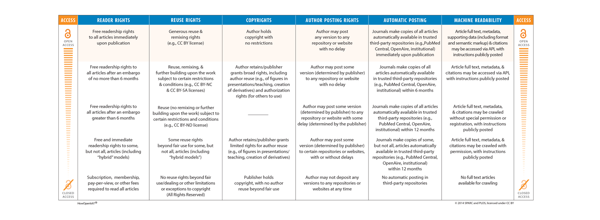

```{r setup, include=FALSE}
knitr::opts_chunk$set(echo = TRUE)
```


## Think back....

On your midterm the extra credit question asked you to find out what the default kmer length was for the kmer clustering step in muscle. Does anyone have a good answer?

Muscle has been cited almost [23,000](https://scholar.google.com/scholar?cites=24007895946176608&as_sdt=40000005&sciodt=0,22&hl=en) times! The Muscle [source code](https://www.drive5.com/muscle/muscle_src_3.8.1551.tar.gz) is "open" so you *could* go read the code and find out for yourself.

## "Open"

What does it mean to create "open" works and why is that important?

### Open Access publications:

```{r echo=FALSE, out.width='100%', fig.align='center'}

```


### Open Source programs in Bioinformatics:

In the field of Bioinformatics there has been a shift in thinking on how to publish code. It is now generally accepted that those who write code should publish it for research use free of charge. Furthermore, it is not generally enough to simply post a program where someone can download it. Rather the original code must be made publicly available for others to use, edit, and review.

The number one most common way to share code is on GitHub. See your [instructor's page](https://github.com/rsh249). For example, the code used to generate the course materials can be found [here](https://github.com/rsh249/bioinformatics).


### Scientific Publishing: Preprints

One great way to rapidly publish new science and simultaneously ensure that there is free access to your work is through publishing Preprints. These are documents that are posted to public websites that archive the work on the web. In biology the bioRxiv project is the primary repository for preprints.

Let's have a look around https://www.biorxiv.org/collection/bioinformatics for recent preprints in bioinformatics. 

WARNING: Preprints have NOT been peer reviewed for quality and soundness of science. Use information from preprints at your own risk. But sometimes that's necessary to keep up with cutting edge research.

# The Course Project

Details can be found [here](https://github.com/rsh249/bioinformatics/raw/master/files/BIO331_biorxiv_project.docx)

# Homework: 

Find a repository that your instructor created and try to figure out what it does. This will be varying degrees of difficult depending on how well the repository is documented. Submit answers to [#git](https://bio200-bioinformatics.slack.com/messages/CCQL816TC) and collaborate with other students who pick the same repository.


