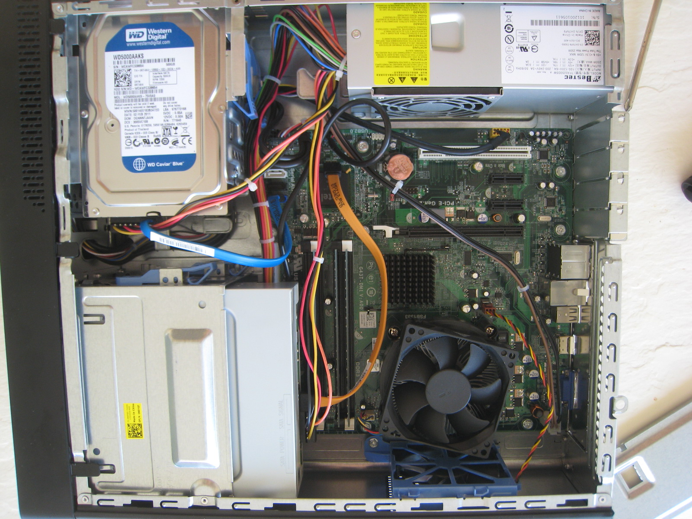
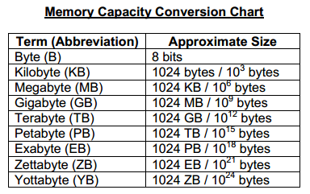
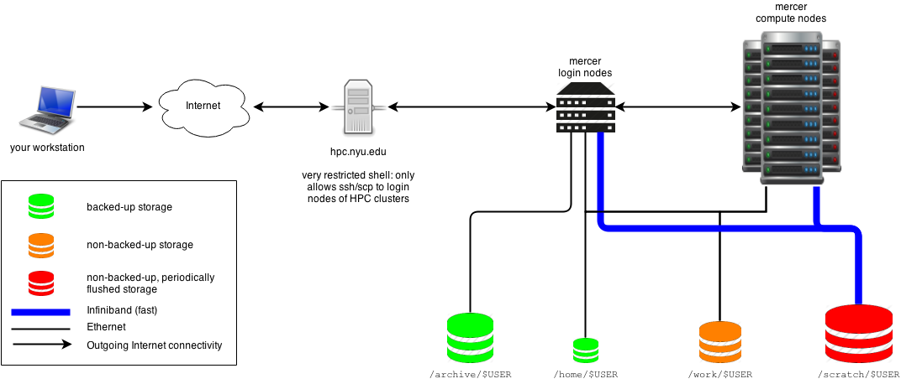

```{r setup, include=FALSE}
knitr::opts_chunk$set(echo = TRUE)
```

# Inside a computer.

Today we will take a tour of the hardware of a basic desktop computer as a segue to talking about High Performance Computing and why we might need all this in the context of bioinformatics.

The guts of a computer look something like this:
[
```{r echo=FALSE, out.width='80%', fig.align='center'}

```
](http://www.pj2t.org/ccc/pc.30.interior.photo.jpg)


# Important hardware you should learn today:

+ CPU -- Calculations/"processing" (math, logical operations)
+ RAM -- "working" memory. 
+ Storage disks (HDD/SSD) - storage memory (works when turned 'off')
+ Motherboard

# Other hardware you might run into (But we won't see today):

+ Video cards/GPU -> Handle video processing for displays but also useful for some parallel computing.
+ Network Attached Storage (NAS) -> Common for data to be stored on a networked machine rather than on the primary server.

# Memory volume units:

[
```{r echo=FALSE, out.width='40%', fig.align='center'}

```
](http://www.ccgscomputerscience.co.uk/students/courses/KS3/LEVEL1/datarepresentation/html/images/memorycapacityconversion.png)

# Investigate your laptop:

In group of two open a terminal/command line window (Ask for help if you're not sure how) and type:

```{}
cat /proc/cpuinfo
```

What do you see?

# But why?

At some point working with data in biology you will probably be asked to work on a project too large to do on your laptop. Then you will have to use a larger, shared machine that is either run by your lab/institution/business or in "The Cloud" (i.e., rented time from [Amazon](https://aws.amazon.com/what-is-cloud-computing/)). 

A High Performance Computer or "Cluster" typically is made of many individual computers strung together into one resource. Sometimes, this can be in one physical box or an entire room. Knowing a little bit about the resources you have access to and the type of work you need to do will help you know how to manage your projects. These resources typically provide many CPUs (dozens of cores or more), more RAM (hundreds of GB), and more storage space (TB scale) than any laptop or personal computer.

[
```{r echo=FALSE, out.width='80%', fig.align='center'}

```
](https://devwikis.nyu.edu/display/NYUHPC/Programming+for+Biologists)

# How do we use more resources?

Since we do not (yet!) have access to a compute resource we can only do small tests on your laptops. However, the R code below should help you see how running a job across multiple cores in your CPU could help you get things done faster.

First, we need some R libraries:

```{r, include=FALSE, echo=TRUE}
#install.packages('parallel') #uncomment this line in your prompt!
```

Load them:
```{r}
library(parallel)
```

Then we need some data:
```{r}
do = seq(1, 10000000)
```

And a baseline: How long does it take to calculate 10 million square roots? (You should have seen this apply() type function in the tutorial for homework)
```{r}
p = proc.time();
l_works = sapply(do, sqrt);
proc.time() - p; #This number tells us how long the job took
```

This time let's do this in parallel on four of your CPU cores:

This involves a few new steps:
1) Open a CPU cluster object (size n)
2) Split job into discrete 'queues'
3) Run job queues across each process (1:n)
4) Collect results data objects
5) Clean up your cluster


```{r}
nclus = 4 #Number of cores to allocate to this job:
cl = makeCluster(nclus, type ='SOCK'); #Create cluster of size n
  p = proc.time()#start timer
  splits = clusterSplit(cl, do) #split job into smaller parts of equal size
  p_works2 = parSapply(cl, splits, sqrt) #Run parts across cluster and collect results
  proc.time() - p #end timer
stopCluster(cl)

```

Look at object p_works and p_works2 and see if they are the same.


# Reminder: Bring data to class on Wednesday!
