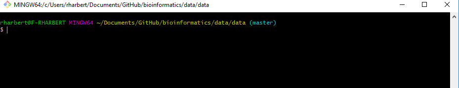

```{r setup, include=FALSE}
knitr::opts_chunk$set(echo = TRUE)
```

# The Unix Shell: A fundamental tool for bioinformatics

Outline:

+ What is the Unix shell? (What's Unix? What's a shell?)
+ Read Evaluate Print Loop (REPL)
+ Why do we need to know this?
+ Interacting with the shell
+ Moving in and viewing your filesystem
+ Files (create, edit, delete)
+ Parsing (search and bulk edit files - read, search, sort, and rearrange files)
+ Advanced topics: Scripting, loops, functions (*Probably for later)


## What is the Unix Shell?

The shell provides an environment to interact with your computer on a more fundamental level than we are used to. It does this by implementing a simple "language" that we can learn to communicate with our machines through a command-line interface.

The command-line runs a Read-Evaluate-Print-Loop operation that is the core of everything we do there. This is essentially what the RStudio Console window does for us in the context of R.

The command-line looks something like this:

```{bash, eval=FALSE}
username@machine /path/to/where/you/are $
```

```{r echo=FALSE, out.width='90%', fig.align='center'}

```

And we interact with the shell by typing a command after the $:

```{bash, eval = FALSE}
pwd
```

What did that do?

## Finding out about your file system: ls, pwd, cd

ls -- List what is in your current directory.

```{bash, eval = F}
ls

ls -a

ls -l
ls -lh
```

### A brief note about getting help:

All command line programs/commands should** have a help file associated with them. We can view those in one of two ways:

```{bash, eval = F}
ls --help

man ls


```

pwd -- print working directory

```{bash, eval =F}
pwd

```


cd -- change working directory

```{bash, eval=F}
# cd into one of the directories you see when you type
ls -F

cd Desktop

# to go up a level (Back usually)

cd ..

# To navigate to your home directory

cd ~
#or
cd


```


## Files - Create, edit, delete files and directories: mkdir, nano, touch, cp, mv, rm, rmdir, cat, head, less

Let's make a new folder in our current directory to play in:

### mkdir - make directory
```{bash, eval=F}
mkdir data
cd data

ls -l

```


There is nothing there because we just created that directory. To make a new file we can use:

### touch

```{bash, eval=F}
touch textfile
```


### nano 

OR a text editor 'nano'. Be sure to put some text into the nano editor and save before closing.

```{bash, eval=F}
nano newfile
```

Use Ctrl+X to close nano and follow the prompts at the bottom of your terminal if needed.

### cp

Let's say we want to make a backup of newfile. We can use 'cp':

```{bash, eval =F}
#Copy with cp
cp newfile backup
```

### cat head

We can do some simple viewing of files with commands 'cat' and 'head'. These behave just like head() and cat() in R.

```{bash, eval=F}
cat newfile
head newfile

```

### wc

And gather basic file statistics with 'wc':

```{bash, eval=F}
wc -l newfile
```

### mv, rm, rmdir

Or maybe we want to move a file to a new place

```{bash, eval=F}

mkdir backdir
mv backup backdir

```

All of that was junk so let's clean up after ourselves by removing the files we made with 'rm' and then the backdir directory with 'rmdir'

```{bash, eval=F}
rm textfile
rm newfile
rm backdir/backup
rmdir backdir
```

NOTE: 'rm' is FOREVER. Be very sure you understand how rm behaves before pressing ENTER.

One dangerous error 

## Searching and manipulating text files:  grep, awk, shuf, sort, uniq

Let's first grab an example data file using a new command 'curl':

```{bash, eval = F}
curl https://raw.githubusercontent.com/rsh249/bioinformatics/master/data/test.txt > test.txt


```

And we can do some basic exploration: (one command at a time!)
```{bash, eval=F}
wc -l test.txt
head test.txt
head -20 test.txt
less test.txt #end with 'q'
cat test.txt 
ls -lh
```

Does this text look familiar? How can we figure out what we have? Why has your instructor made this so difficult?

### grep

A command you all NEED to know that helps search through big files is 'grep'. Once again R has a grep() function that works on similar principles. Unix grep is one of the most used tools in bioinformatics data exploration.

```{bash, eval=F}
grep --help
grep "the" test.txt #print all lines with the word "the"
grep -c "the" test.txt # count lines matching "the"
grep -cw "the" test.txt # why is this different?

```

Things can get more complicated with [Regular Expressions](https://www.cyberciti.biz/faq/grep-regular-expressions/) but for now (until we start working with FASTA and fastq files) we will deal only in whole strings of characters.

It looks like this file has some old English phrases in it. Maybe it's Shakespeare. But which one? Let's try to grep out some key words that could help us figure it out:

```{bash, eval=F}
grep -i "romeo" test.txt
```

Nope....

```{bash, eval=F}
grep -i "othello" test.txt
grep -i "henry" test.txt
grep -i "lear" test.txt
grep -i "petruchio" test.txt
```

hmm... What do we have?

We have a scrambled text file that is a collection of Shakespeare plays. Can we sort this file out and make it readable again? YES! Better living through the power of Unix!


### sort

The 'sort' command does (sometimes) exactly what it sounds like. This file that we have looks like it has line numbers at the start of every line. Let's see if that is the case:

**the ">" here redirects the output into a new file. This is REALLY USEFUL.

```{bash, eval=TRUE}
sort test.txt > sort.txt
head sort.txt
```

Not quite. Check sort --help and see if you can fix it!

### awk

Now let's look at a tabular data file and why we need "awk" in addition to grep.

```{bash, eval =F}
curl https://raw.githubusercontent.com/rsh249/bioinformatics/master/data/ebd_trim3.csv > ebird.csv

head ebird.csv
```

This is a small chunk of the eBird database. How big is this file?

```{bash, eval=F}
wc -l ebird.csv
ls -lh ebird.csv

```

Searching this file with grep works OK ....

```{bash, eval=F}
grep -i 'mallard' ebird.csv
```

Downsides: 
1) grep looks anywhere in the line, not just the column where the common name resides.
2) There are too many columns to read anything easily.

This is where awk is really useful. Could you read this into R, sure. But remember that this is a tiny example. If you had a table that was even 10% of the entire eBird database you would not be able to read that into the RAM available on your laptop. 'awk' can deal with very large files in a much more efficient way and is really useful for exploring data and retreiving the parts you want.

Example: Use awk to print just specific columns. 
Aside: The pipe "|" symbol passes the output of one command to the next command typed. We will do more with this.

```{bash, eval =F}
grep -i 'osprey' ebird.csv | awk '{print $1, $2, $3}'
```

But what columns to we really want?

```{bash, eval=F}
head -1 ebird.csv
```

Let's look at only #1 (ID), #5 (common name), and #6 (latin name)

```{bash, eval =F}
grep -i 'osprey' ebird.csv | awk '{print $1, $5, $6}'
```

Is that what we wanted? Not quite, the defualt field delimeter in grep is any white space (space, tab, and a few other variants). The delimeter in this file is a tab character(\t).

We can tell awk that with the -F parameter

```{bash, eval=F}
grep -i 'osprey' ebird.csv | awk -F'\t' '{print $1, $5, $6}'
```

Now we can see that our grep command is not actually finding all Osprey records. It is fingind the word Osprey somewhere else in the line for some other bird records.

We can fix that with awk by supplying an "if" statement

```{bash, eval=F}
awk -F '\t' '$5=="Osprey" {print $1, $5, $6}' ebird.csv
```

Challenge: Can you write an awk command to grab the ID, names, and latitude and longitude and put that in it's own file?

### sort | uniq

A useful pair of tools is 'sort' and 'uniq'. These do what they say: sort a list and find unique elements. 'uniq' is a fast algorithm but only removes duplicates in series so you should always uses sort and then uniq.

Example:
```{bash, eval=F}
awk -F '\t' '{print $17}' ebird.csv  #counties in our eBird slice.
awk -F '\t' '{print $17}' ebird.csv | sort 
awk -F '\t' '{print $17}' ebird.csv | sort | uniq


```

And to see that we need sort with our uniq just count the output:
```{bash, eval =F}

awk -F '\t' '{print $17}' ebird.csv | sort | uniq | wc -l
awk -F '\t' '{print $17}' ebird.csv | uniq | wc -l

```


# For further reading: The GNU project

https://www.gnu.org/gnu/thegnuproject.en.html


# Homework:

Go to: https://swcarpentry.github.io/shell-novice/

Work through the tutorial on the Unix Shell from Software Carpentry and create a notes file. Turn in your notes by email before class on Monday. Note that the recommended time to teach this entire tutorial is 4.5 hours. I don't know how long it will take each of you independently to work through it but I think more than 1 hour should be a minimum.


